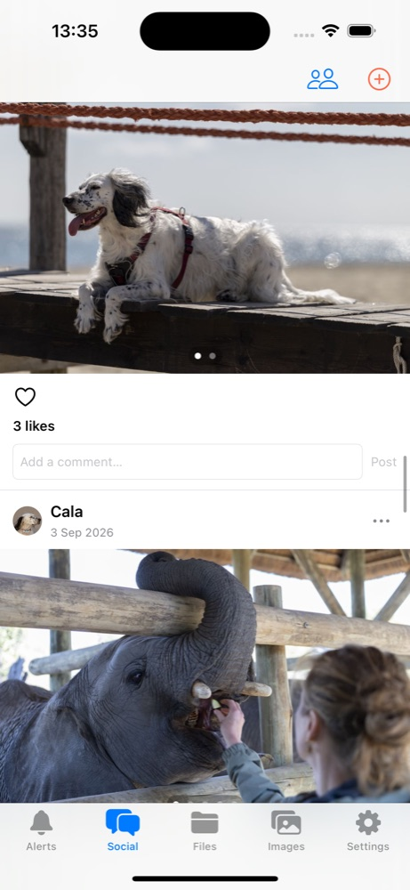
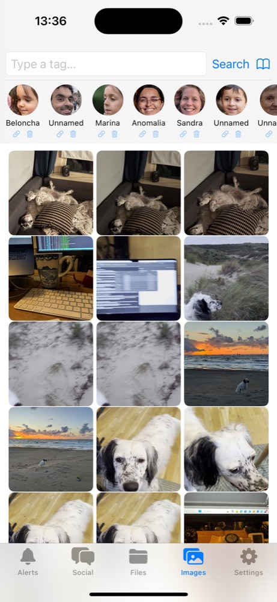
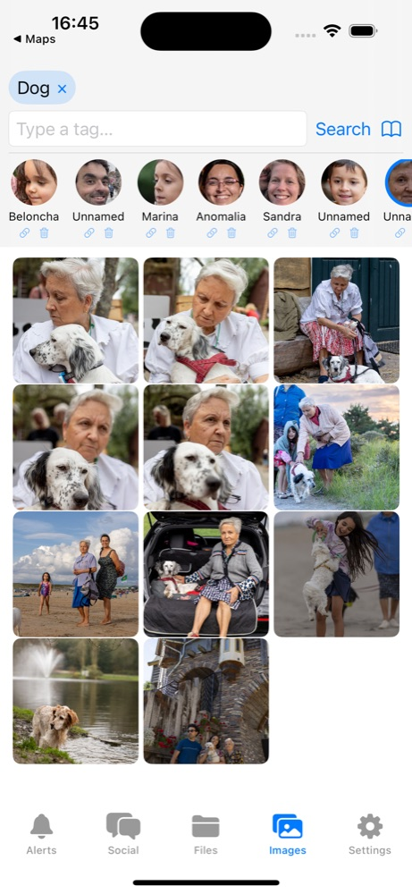
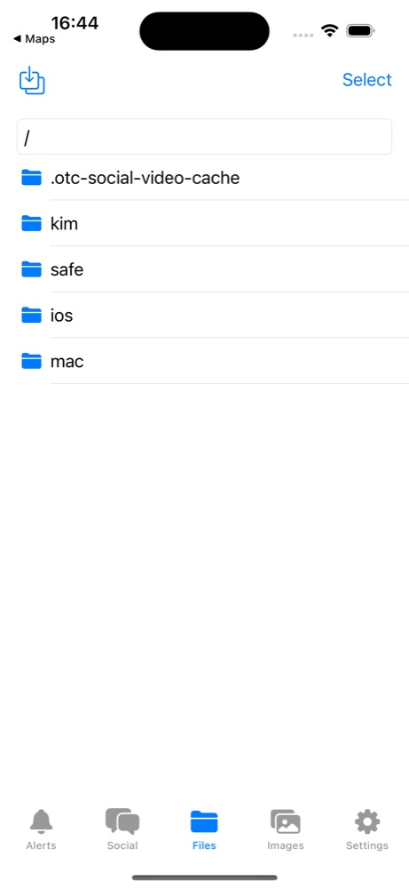
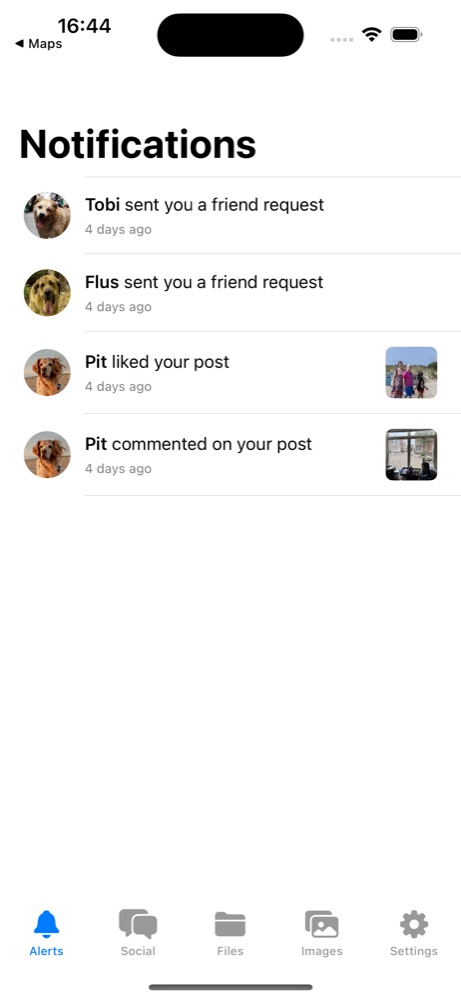
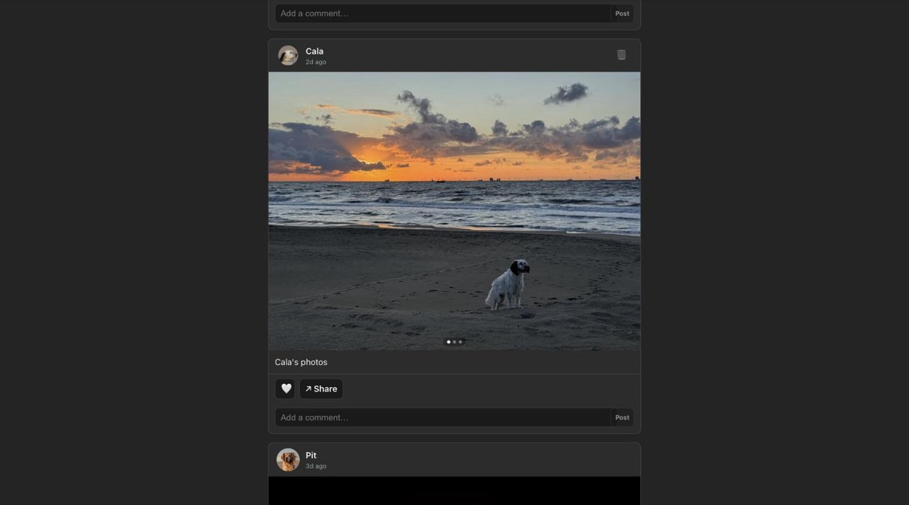
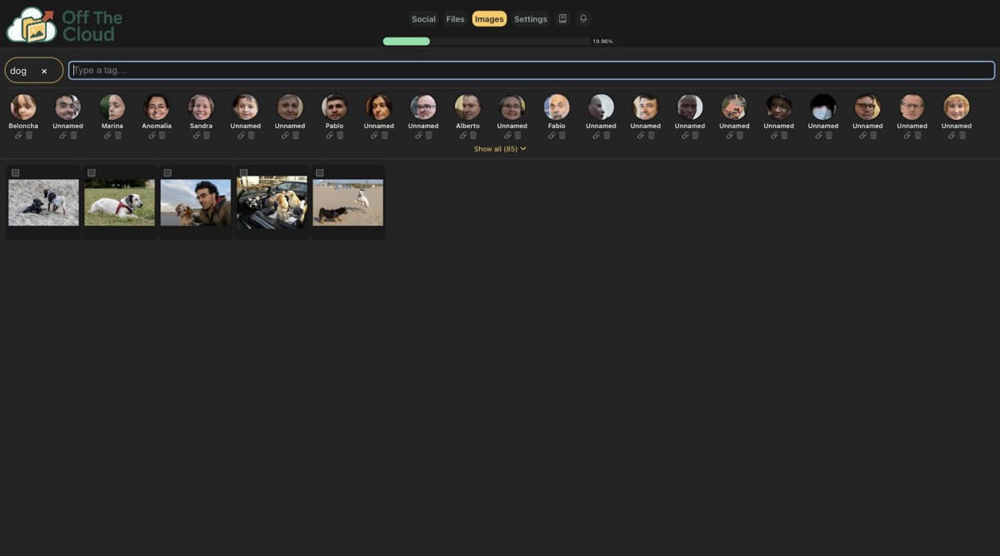
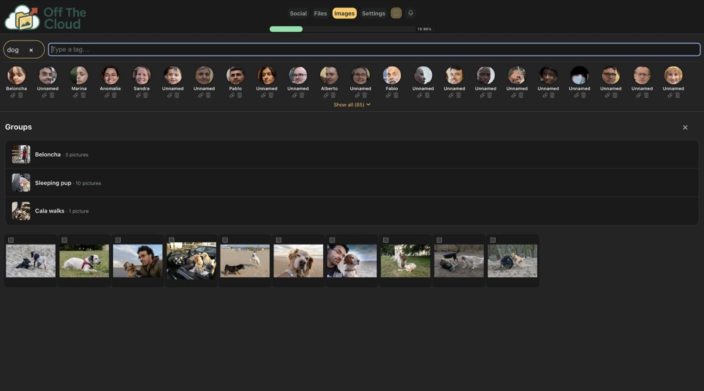
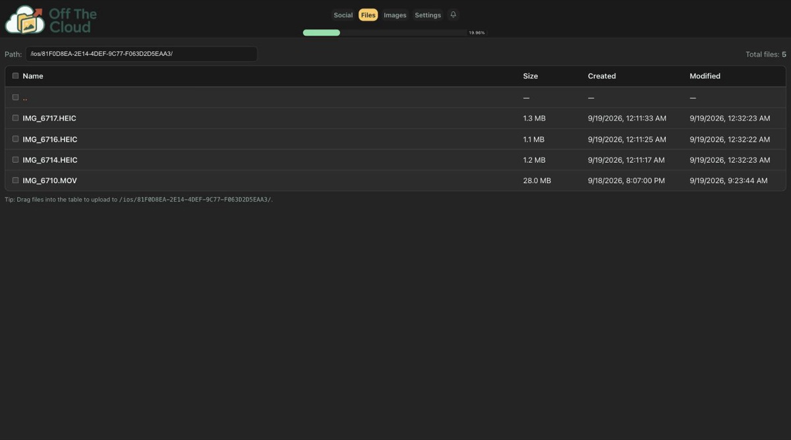
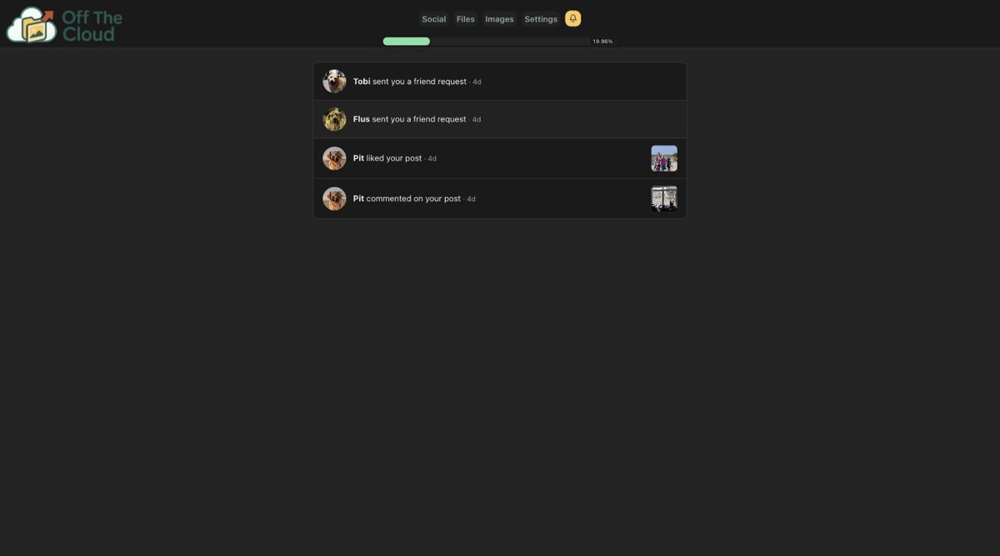

**Off The Cloud**
==============

OTC is a self hosted and inexpensive *NAS* solution to backup all your photos, videos and important documents, but it is also a ethical and safe *Social Network* free of toxic behaviours, harassment, doom scrolling, data harvesting, influencers... just a space to share memories with your family and friends that you own and you control.

OTC runs in your mobile devices as a iOS or Android application that can be download from the store (they are still not published). These apps will backup in background all the photos to the device in full resolution, we also have a MacOS and Windows client to backup and keep in sync folders in your computer.

OTC is hosted in your home using your network connection and inexpensive hardware, everything is designed to work on a Raspberry Pi 5 with 8GB of RAM and two MicroSD cards in a RAID 1 configuration to store the data. The estimated cost of all the necessary hardware for a 1TB device is under 250 euros.

**OTC is composed by four systems:**
====================================

**The "device"**

This is the Raspberry Pi with two micro-SDs and two custom status leds that is used to store all your data and two custom LEDs to show the status of the RAID


**The MacOS/Windows application**

A menu-bar app that keeps folders on your computer in sync with the device - watch local folders, or pull a remote folder down to a local one


**The iOS/Android app**

This is used to access all the data, sync photos and documents from your mobile device, Social Network app and much more

<p>



</p>
<p>


</p>


**The Web app**

With this you can access all your data and social network from any browser just with your password







**Recommended Hardware**
========================
- 1x [Raspberry Pi 5 with 8GB or RAM](https://www.raspberrypi.com/products/raspberry-pi-5/)
- 2x USB MicroSD card readers
- 2x MicroSD Cards of the same size for storage
- 1x MicroSD card to host the OS in the RaspberryPi
- 1x [Power Supply](https://www.raspberrypi.com/products/27w-power-supply/) (Use something of at least 27W since the consumption is quite high when processing images)
- 1x [Active Cooler](https://www.raspberrypi.com/products/active-cooler/)

**Installation of the device**
==============================

There are four ways to set up a device, from least to most work: flash the pre-built image (a
Raspberry Pi 5 with at least 8 GB of RAM - no keyboard, monitor or Linux knowledge needed, RAID1
included), run the one-line install script against a machine you already have login access to
(Ubuntu, Debian, Raspberry Pi OS or another Debian-based 64-bit distro - no flashing, no RAID/status
LEDs), run `Makefile.pi` against a plain Raspberry Pi OS install (if you want to build from source),
or follow the manual steps yourself.

**Option 0: One-line install script (any Debian/Ubuntu machine)**
-------------------------------------------------
Already have a Debian/Ubuntu-family Linux box you can log into (Ubuntu, Debian or Raspberry Pi OS,
64-bit - a Raspberry Pi, an old laptop, a VPS)? Skip flashing anything - log in and run:

```
$ curl -fsSL https://raw.githubusercontent.com/alonsovidales/otc/main/scripts/install.sh | sudo bash -s -- <subdomain>
```

`<subdomain>` is this device's bridge address, e.g. `pit` for `pit.off-the.cloud` - omit it and the
script prompts for one. It installs MariaDB, a native Go toolchain, ONNX Runtime, the RAM++ tagging
model, and builds the `otc` binary from source right there, then writes the database schema, app
config, and a systemd service - the same bring-up `Makefile.pi` automates over SSH from a separate
dev machine, just run directly on the device itself with no cross-compiling or second computer
needed. It's safe to re-run any time (e.g. to pick up new code) - device identity (UUID, DB
password, bridge secret) is only ever generated once, on the first run.

This path doesn't set up a RAID1 array, the WiFi-AP first-boot flow, or the RAID status LEDs - it
assumes a single disk and a machine you already have network/login access to. For a RAID1 array
across two disks, run `Makefile.pi`'s `raid`/`raid-watch` targets afterwards (see Option 2), or use
the pre-built image below instead, which handles all of that from a first boot with nothing
pre-configured.

**Option 1: Flash the pre-built image (easiest - Raspberry Pi 5, 8 GB+ of RAM)**
--------------------------------------------------
The image is for a **Raspberry Pi 5 with at least 8 GB of RAM** (the tagging model and the build
from source need the memory). It is a stock Raspberry Pi OS Lite with a first-boot setup wizard on
it and nothing else (about 530 MB). The wizard asks for your WiFi, the device's name and its disks, then installs the
current software with the same `install.sh` as Option 0, showing its progress - so there is never
an "old image": whatever you flash installs today's release.

1. Download [off-the-cloud-rpi-lite-arm64.img.xz](https://github.com/alonsovidales/otc/releases/download/image/off-the-cloud-rpi-lite-arm64.img.xz)
   (the `.sha256` next to it lets you check the download with `shasum -a 256 -c`).
2. Flash it to a MicroSD card with [Raspberry Pi Imager](https://www.raspberrypi.com/software/): choose
   "Use custom", pick the downloaded `.img.xz` file, select your card, and write. Don't use Imager's
   own `Customisation` step - the wizard handles WiFi and identity itself.
3. Plug in the USB disks you want to use (two for RAID1), put the card in the Pi and power it on.
   After a minute it opens its own WiFi network called **"Off The Cloud"** (no password). Join it
   from your phone: the "sign in to network" sheet opens the wizard (or open a browser and go to
   any address). Wired into your router instead? Open the address your router shows for a device
   called `otc` (or `http://otc.local/` where that resolves).
4. The wizard walks through four steps:
   - **WiFi**: pick your network (2.4 GHz networks are listed; the Pi can move to 5 GHz once it
     is set up) and enter its password. The Pi joins it while keeping its own hotspot up. The
     hotspot restarts for a few seconds to move to your network's channel, so your phone may get
     disconnected: if it doesn't rejoin "Off The Cloud" by itself, reconnect to it in your WiFi
     settings and come back to the page, which carries on once the Pi is online.
   - **Name**: the device's `<name>.off-the.cloud` address, checked as you type and reserved on the
     bridge the moment you continue.
   - **Storage**: the disks it found, with sizes. Pick two to mirror them as RAID1 (both are
     wiped), or none to keep everything on the SD card for now.
   - **Install**: a progress bar over the install script's steps, with what it is doing under it
     and the log one tap away. This takes a while on a Pi - it downloads the tagging model and
     builds the software from source - about 20 minutes. You don't have to wait on the hotspot:
     once the name is reserved you can close the page and disconnect; when the installation is
     complete, open `https://<name>.off-the.cloud` from any network. To check the progress
     meanwhile, connect to the "Off The Cloud" WiFi again and the page comes back.
5. When it finishes, the wizard waits until the bridge sees the device connected, then shows its
   address, `https://<name>.off-the.cloud` - open it in your browser; the app asks you to choose
   the owner password and set up your profile. The hotspot switches off a minute later and the
   setup wizard with it; the hotspot only comes back if the device ever loses its network.

**Replacing a dead Pi**: if the Pi died but its two disks didn't, flash a new card with the same
image, attach the same disks, and go through the wizard again. At the Storage step it finds the
existing Off The Cloud array (and the database on it) and offers to **recover** it: the array is
reassembled instead of wiped, the database comes back with everything in it - photos, files,
friends, the owner password - and the device presents its old name and bridge identity, so there
is no Name step and no new password. The wizard then checks the device is really back on the
bridge; only if it isn't (the old name was released, say) does it ask for a name and register the
recovered device under it.
6. Wiring the RAID status LEDs to the GPIO pins is still a manual, physical step - see step 4 under
   the manual instructions below for the pinout.

**Console access.** The image doesn't enable SSH. If you ever need a shell on the device itself,
plug in a keyboard and monitor and log in as:

| user | password |
|---|---|
| `otc-debug` | `off-the-cloud` |

It has `sudo`. Nothing about normal setup or day-to-day use needs it; it's for troubleshooting
and the few things listed here:

- **Enable SSH** (optional, for remote troubleshooting): `sudo systemctl enable --now ssh`, then
  put your public key in `~otc-debug/.ssh/authorized_keys` and use `ssh otc-debug@<name>.local`.
- **Force an update from the console** - normally you press **Update** in Settings, but a device
  installed before release 5 can't start one on its own and needs this once:
  ```
  sudo bash -c 'curl -fsSL https://raw.githubusercontent.com/alonsovidales/otc/main/scripts/update.sh -o /tmp/update.sh && bash /tmp/update.sh'
  ```
  It prints nothing; follow it with `tail -f /var/log/otc/update.log`.
- **Logs**: the device's own log is `/var/log/otc/otc.log`, the setup wizard's is
  `journalctl -u otc-setup`, and an update's is `/var/log/otc/update.log` (its current state is in
  `/var/lib/otc/update-status.json`).

To build and publish the image yourself (only needed when the wizard or hotspot scripts change -
the software it installs always comes from `main`), with `TARGET` in `makefile` pointing at any
arm64 Linux box you can SSH to as `otc` (a Pi is fine):

```
$ make image           # builds on TARGET (scripts/build_image.sh), copies dist/off-the-cloud-rpi-lite-arm64.img.xz back
$ make image-publish   # uploads it to the rolling "image" GitHub release, at the URL linked above
```

**Using the setup wizard**
---------------------------
Whether you flashed the pre-built image or ran `Makefile.pi`/the manual steps against a plain OS
install, the very first time you open the device's web app (`http://<device>:8080/`, or through the
mobile/desktop apps) with no owner password set yet, you land straight on a short setup flow instead
of the normal sign-in screen:

1. **Owner name + password** - the password you set here becomes the device's permanent
   password from that point on (there's no separate "create account" step later - whatever you type
   here *is* the account). Pick something you can keep somewhere safe: it also protects your files and
   social profile.
2. **Storage** - if the device found spare USB drives attached (beyond the boot SD card), you can
   pick up to two: pick two to mirror them into a RAID1 array (recommended - your files survive one
   disk failing), pick one to use it alone with no redundancy, or pick none to just use the boot disk.
   Building the array happens in the background after this step, so it's normal for storage to not be
   "ready" the instant you click through.
3. **WiFi** - only matters if you reached the device over its own temporary "Off The Cloud" network:
   pick your real WiFi from the scanned list and enter its password. Already connected some other way
   (ethernet, or WiFi set up through Raspberry Pi Imager)? Just skip this - joining a new network here
   will drop whatever temporary connection got you to this page in the first place, so reconnect to
   your normal WiFi afterwards and find the device there.

After that you're dropped into the normal app, signed in. You can revisit the owner name, password,
and bridge shared secret any time from Settings.

**Option 2: `Makefile.pi` against a plain OS install**
--------------------------------------------------------
1. Install [Raspberry Pi OS (64-bit)](https://www.raspberrypi.com/software/operating-systems/) in the Raspberry Pi using [this tutorial](https://www.raspberrypi.com/documentation/computers/getting-started.html#raspberry-pi-imager). In `Customisation` select Enable SSH, use `otc` as the user name, and enable passwordless sudo for it (the default for the account created there).

`Makefile.pi`, in the root of this repository, does everything from step 2 onwards on its own: builds the RAID1 array, installs and configures MariaDB, installs Go and ONNX Runtime, exports the RAM++ tagging model directly on the device, loads the database schema, writes the app config and systemd service, and finally builds and deploys the app itself. Run it from your computer (not the Pi), with the repository checked out:

```
$ make -f Makefile.pi bootstrap TARGET=<device_addr_or_hostname> DISK1=/dev/sda DISK2=/dev/sdb
```

A few things worth knowing before you run it:
- It only wipes `DISK1`/`DISK2` after showing you `lsblk` output and asking you to type `yes` to confirm - double check those are the right two disks before confirming. If a RAID1 array already exists on the device it skips the wipe automatically (pass `FORCE=1` to rebuild it from scratch).
- The RAM++ model export step runs the full torch/transformers pipeline on the Pi itself, so budget real time and bandwidth for it (a multi-GB download).
- The device's generated secrets (DB password, device UUID, bridge secret) are written to a local `.env.pi` file the first time you run it - keep that file, don't commit it, and don't lose it, since it's the only place the DB password is recorded.
- Re-running `bootstrap` (or any individual target) is safe; most steps detect what's already been done and skip it.

Once bootstrapped, day-to-day use is just:

```
$ make -f Makefile.pi deploy   # build the current code and (re)start the service on the device
$ make -f Makefile.pi status   # service / DB / RAID / healthcheck status
$ make -f Makefile.pi logs     # tail the service logs
```

Run `make -f Makefile.pi help` for the full list of targets (e.g. to re-run just `raid`, `mariadb`, `models`, or `onnxruntime` if one step needs retrying). Wiring the RAID status LEDs to the GPIO pins is still a manual, physical step - see step 4 below for the pinout.

The rest of this section documents what `Makefile.pi` does under the hood, step by step - useful if you want to customize the install, understand what changed on the device, or finish the job by hand if a step fails.

**Option 3: Manual installation (step by step)**
-------------------------------------------------
2. SSH into the device and update the OS:
```
$ sudo apt-get update
$ sudo apt-get upgrade
```

3. Execute the next in order to create the RAID1:
```
$ sudo wipefs -a /dev/sda
$ sudo wipefs -a /dev/sdb
$ sudo mdadm --create --verbose /dev/md0 --level=1 --raid-devices=2 /dev/sda /dev/sdb
$ sudo mkfs.ext4 /dev/md0
$ sudo mkdir /mnt/storage
$ sudo mount /dev/md0 /mnt/storage
$ sudo mdadm --detail --scan >> /etc/mdadm/mdadm.conf
$ sudo update-initramfs -u

# Add to /etc/fstab if you want it mounted automatically:
/dev/md0   /mnt/storage   ext4   defaults   0   0
```

4. Add the RAID monitorig service
Create `/etc/systemd/system/raid-watch.service` with:
```
[Unit]
Description=RAID1 watcher + LED driver
After=multi-user.target mdadm.service

[Service]
Type=simple
ExecStart=/usr/bin/python3 /usr/local/bin/raid_watch.py
Restart=on-failure
User=root

[Install]
WantedBy=multi-user.target
```
then:
```
# From the local repo directory:
$ scp scripts/raid_watch.py otc@<device_addr>:/tmp/
# Connect by SSH to the device
$ sudo mv /tmp/raid_watch.py /usr/local/bin/raid_watch.py
$ sudo chmod +x /usr/local/bin/raid_watch.py
$ sudo systemctl daemon-reload
$ sudo systemctl enable --now raid-watch.service
```
For the status leds to work, you have to connect them to the GPIO ports as in: https://github.com/alonsovidales/otc/blob/1dec544957b5e41a49b99933cb6b5ba55ebf5ce5/scripts/raid_watch.py#L47-L52

You can use 3mm Red & Green LED Diode Light like: https://www.amazon.nl/-/en/dp/B01CFZMSNO

4. Install MariaDB and set the datadir to use the RAID:
```
$ sudo apt-get install mariadb-server
$ sudo mkdir /mnt/storage/mysql
$ sudo rsync -aHAX --numeric-ids --info=progress2 /var/lib/mysql/ /mnt/storage/mysql
```
Edit `/etc/mysql/mariadb.conf.d/50-server.cnf` and replace:
```
#datadir                 = /var/lib/mysql
```
by:
```
datadir                 = /mnt/storage/mysql
```
start MariaDB and check that the directory is properly set:
```
$ sudo systemctl start mariadb
$ sudo mysql -uroot -p -e "SHOW VARIABLES LIKE 'datadir';"
```
Populate the DB with the content from `db/db.sql`
Add the settings row that will be used to identify the device and connect to the bridge:
```
insert into settings (`device_uuid`, `subdomain`, `bridge_secret`) values ('<device_uuid>', '<device_domain>.off-the.cloud', '<device_secret>')
```
You can put random values there if you don't plan to use the bridge, but if you want your device to be remotely accesible, send us an email to: `avidales@off-the.cloud` and we will add your device. By the moment we only grant access to contributors, we will open the bridge to the pubic when the project is considered stable.

5. Edit the [MakeFile](https://github.com/alonsovidales/otc/blob/main/makefile#L11) and specify in `TARGET` the IP Address or hostname used by the Raspberry Pi

6. Create the `www` directory and install Go (use the latest version for Linux ARM64):
```
$ wget https://go.dev/dl/go1.26.1.linux-arm64.tar.gz
$ sudo tar -C /usr/local -xzf go1.26.1.linux-arm64.tar.gz
$ echo "export PATH=\$PATH:/usr/local/go/bin" >> .bash_profile
```

7. In your local machine, clone the repository and make the project:
```
$ git clone git@github.com:alonsovidales/otc.git
$ cd otc
# Edit makefile and replace TARGET by the address or hostname of the device
$ make all
```

8. Build the database:
```
$ sudo mysql -u root
> create database otc;
> CREATE USER 'otc'@'localhost' IDENTIFIED BY '<your_pass_here>';
> GRANT ALL PRIVILEGES ON otc.* TO 'otc'@'localhost';
> GRANT ALL PRIVILEGES ON *.* TO 'otc'@'localhost' WITH GRANT OPTION;
> exit
```
The second `GRANT` (issue #82, multiple users on one device) lets the
`otc` account provision/drop a whole database + dedicated MySQL user per
additional user at runtime (see `dao/provisioning.go`) — required even if
you never add a second user, since `scripts/install.sh`/`Makefile.pi` both
apply it unconditionally as part of the base setup. Skippable only if
you're certain you'll never use the Settings → Users panel; without it,
creating a user fails with `Access denied ... to database 'otc_<uuid>'`
(a MySQL account can't `GRANT` a privilege it doesn't itself hold — the
narrower `CREATE, DROP, CREATE USER, GRANT OPTION` set this project used
before learning that the hard way isn't enough).

9. Create the OTC config file in `/etc/otc_dev.ini` like:
```
[otc]
bridge-addr=off-the.cloud
storage-path=/mnt/storage/
unenc-storage-path=/mnt/storage/unencrypted/
max-thumbnail-width-px=1000
shared-link-ttl-hours=168
# Every outbound friend/bridge connection this device makes must be to a
# domain ending in this TLD (defaults to off-the.cloud if omitted) — closes
# off dialing an arbitrary attacker-supplied domain (e.g. an inbound friend
# request naming a LAN address) as an SSRF vector. Set this if you're
# running your own separate network of devices under your own domain
# instead of the public off-the.cloud bridge.
friend-domain-tld=off-the.cloud
# How many standby connections this device keeps open to the bridge, ready
# to be handed to a client (see websocket.ensureBridgePool). Each one is
# pinned to a client for that client's *entire* session, not released after
# one request, so this needs to cover every concurrent session (phone app,
# Mac app, browser tabs, friends) this device is expected to serve through
# the bridge at once. Defaults to 20 if omitted.
bridge-pool-target=20

[logger]
log_file=/var/log/otc/otc.log
max_log_size_mb=10
level=debug

[otc-api]
base-url=otc/
static=/var/www/
port=8080
ssl-port=443
ssl-cert=
ssl-key=

[mysql]
user=otc
pass=<your_password_here>
port=3306
db=otc

[tagger]
model-path=/usr/local/models/ram_plus_swin_large_14m.int8.onnx
tags-path=/usr/local/models/tag_list_4585.txt
thresholds-path=/usr/local/models/tag_list_4585_thresholds.txt
tags-per-image=10
max-images-search=5

# Optional (issue #43) - push notifications to the iOS app when a friend
# posts. Omit this whole section and it's simply skipped (the device token
# still registers, just nothing gets sent) - web push needs no such section
# at all, since the device generates its own VAPID keypair on first use.
# Get these four values from your own Apple Developer account: Certificates,
# Identifiers & Profiles > Keys > create one with the "Apple Push
# Notifications service (APNs)" capability, download its .p8 file (Apple
# only lets you download it once), and note its Key ID and your Team ID.
# Bridge only - never on a device. The APNs auth key is the developer
# team's private key; devices ask the bridge to send (BridgeNotify).
[apns]
key-path=/etc/otc/apns_auth_key.p8
key-id=<key id from the Apple Developer portal>
team-id=<your Apple Developer team id>
bundle-id=cloud.off-the.OffTheCloud
# 1 once the app is TestFlight/App-Store distributed; leave unset (or 0)
# while testing against Xcode's own debug builds, which use the sandbox
# APNs environment instead.
production=0

# Optional (issue #52) - face recognition ("People" search), humans only.
# Omit this whole section and the feature just stays unavailable - it's
# off by default (toggled from Settings in the app) even when this is
# present. See step 11 below for where to get these two model files.
[faces]
detector-model-path=/usr/local/models/face_detection_yunet_2023mar.onnx
recognizer-model-path=/usr/local/models/face_recognition_sface_2021dec_int8.onnx
```

10. Download the models. `thresholds-path` is optional (older/from-scratch
    exports have no threshold file — drop that line if you go with the
    `models-export` fallback further below); when set, RAM++'s own per-tag
    calibrated cutoffs are used instead of one flat threshold for all 4585
    tags, which is more accurate. From the repository directory:
```
$ cd models
$ curl -fL -o ram_plus_swin_large_14m.int8.onnx https://huggingface.co/anakhiu/ram-plus-onnx-int8/resolve/main/ram_plus_int8.onnx
$ curl -fL -o tag_list_4585_thresholds.txt https://huggingface.co/anakhiu/ram-plus-onnx-int8/resolve/main/ram_tag_list_threshold.txt
$ scp ram_plus_swin_large_14m.int8.onnx tag_list_4585_thresholds.txt tag_list_4585.txt otc@<otc_addr>:/usr/local/models/
```
    (This is a community-hosted INT8 re-export of the same RAM++ Swin-Large
    weights and 4585-tag vocabulary used below — same tags, ~2-3x faster,
    half the size, no measurable accuracy loss in testing. If it's ever
    unavailable, `make -f Makefile.pi models-export` exports the original
    fp32 model from scratch instead — see that target for the manual
    equivalent, which needs a Python/torch/transformers toolchain and takes
    much longer.)

11. Install ONNX runtime:
```
$ wget https://github.com/microsoft/onnxruntime/releases/download/v1.24.3/onnxruntime-linux-aarch64-1.24.3.tgz
$ tar -xzf onnxruntime-linux-aarch64-1.24.3.tgz
$ sudo mv onnxruntime-linux-aarch64-1.24.3 /opt/onnxruntime
```

    Issue #52 (face recognition, "People" search) needs OpenCV's actual
    headers/libs at build time (unlike ONNX Runtime above, found via
    pkg-config rather than a manually-placed .so), and the two small
    (~230KB + ~10MB) YuNet/SFace models:
```
$ sudo apt-get install libopencv-dev pkg-config
$ curl -fL -o /usr/local/models/face_detection_yunet_2023mar.onnx https://github.com/opencv/opencv_zoo/raw/main/models/face_detection_yunet/face_detection_yunet_2023mar.onnx
$ curl -fL -o /usr/local/models/face_recognition_sface_2021dec_int8.onnx https://github.com/opencv/opencv_zoo/raw/main/models/face_recognition_sface/face_recognition_sface_2021dec_int8.onnx
```
    Both are official OpenCV Zoo models (MIT/Apache-2.0), designed as a
    matched pair - see `face_recognition/face_recognition.go`'s package doc
    comment. The feature stays off until turned on from Settings in the app
    regardless of whether these are installed; skip this if you don't want
    it.

12. In your computer, in the repository directory execute: `make all`, this will compile nd copy all the content to the device, note that you need [Go installed](https://go.dev/doc/install). Everytime that you want to change something and re-compile, this is the step to run

13. Connect by SSH to the device and execute the next in order to register the service:
```
$ sudo mkdir -p /var/log/otc
$ sudo chown otc:otc /var/log/otc
$ sudo chmod 755 /var/log/otc

$ sudo mkdir -p /etc/otc
$ sudo bash -c 'cat >/etc/otc/otc.env <<EOF
OTC_LOG=info
OTC_ADDR=:8080
EOF'
sudo tee /etc/systemd/system/otc.service >/dev/null <<'UNIT'
[Unit]
Description=Off The Cloud service
Wants=network-online.target
After=network-online.target

[Service]
Type=simple
User=otc
Group=otc
# If you want a writable working dir at runtime:
WorkingDirectory=/var/lib/otc

# Load environment variables (optional)
EnvironmentFile=-/etc/otc/otc.env

# Start command as dev, the cofig is in: /etc/otc_dev.ini
ExecStart=/usr/bin/otc dev

# Restart policy
Restart=on-failure
RestartSec=3

# Resource & fd limits (tweak to your needs)
LimitNOFILE=65535

# Runtime directories (systemd creates them with proper perms)
RuntimeDirectory=otc
StateDirectory=otc
LogsDirectory=otc

# Security hardening (safe defaults; relax if needed)
NoNewPrivileges=true
PrivateTmp=true
ProtectSystem=full
ProtectHome=true
ProtectKernelTunables=true
ProtectKernelModules=true
ProtectControlGroups=true
CapabilityBoundingSet=CAP_NET_BIND_SERVICE
AmbientCapabilities=CAP_NET_BIND_SERVICE
SystemCallArchitectures=native

[Install]
WantedBy=multi-user.target
UNIT

$ sudo systemctl daemon-reload
$ sudo systemctl enable --now otc.service
```

14. If everything went well, you should be able to see the process running with:
```
$ journalctl -u otc -f
```
and the logs in:
```
$ tail -f /var/log/otc/otc.log
```
To connect locally use the `8080` port: http://<local_ip>:8080

If you have configured the bridge you should be able to connect in: https://<domain>.off-the.cloud/

**When clicking in "Sign In" it will ask you for a password, be careful because the first time, sice the password is not set, whatever you set will be your password.**

## Bridge admin panel

The bridge (`bridge/`, deployed separately - see `bridge/makefile`) has a small admin panel at
`https://off-the.cloud/admin` for whoever operates the bridge: log in, see/add/remove registered
devices, and check per-device metrics (requests/bandwidth, hourly) and a security log of rejected
bridge-registration attempts (wrong owner/secret for a claimed domain).

There's no sign-up - bootstrap (or change) an admin account from the bridge's shell:
```
$ sudo /usr/bin/otc_bridge <env> set-admin-password <username> <password>
```
`[admin] session-secret` must also be set in the bridge's config file (`/etc/otc_<env>.ini`) - a
random value that stays stable across restarts, e.g. `openssl rand -hex 32` - otherwise every
restart logs every admin out.

## License

OTC is licensed under the [GNU Affero General Public License v3.0](LICENSE) (AGPL-3.0-or-later).

In short: you're free to use, study, modify, and redistribute this code, including forking it -
but if you run a modified version as a network service (for example, your own bridge relay), the
AGPL requires you to make that modified source available to your users too. This is stronger than
the plain GPL specifically to cover server/SaaS-style use, which is most of what this project is.

Every source file carries an `SPDX-License-Identifier: AGPL-3.0-or-later` header; see
[CONTRIBUTING.md](CONTRIBUTING.md) for what that means for contributions.
